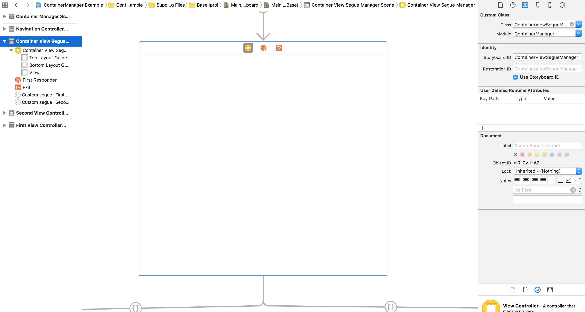

# ContainerManager

[](https://travis-ci.org/brurend/ContainerManager)
[](http://cocoapods.org/pods/ContainerManager)
[](https://github.com/Carthage/Carthage)
[](http://cocoapods.org/pods/ContainerManager)
[](http://cocoapods.org/pods/ContainerManager)

## Usage

### ContainerViewSegueManager

`ContainerViewSegueManager` is responsible for telling your `UIViewController` which segue it should perform.

#### Creating your containerView

After dropping your container into your `UIViewController` you should name its embedSegue identifier:


you also need to make sure the embed `UIViewController` custom class is `ContainerViewSegueManager`



and then in your `UIViewController` class override `prepareForSegue:sender:` with references to `ContainerViewSegueManager` and
an instance of your `ContainerDataManager` subclass:

```swift
override func prepareForSegue(segue: UIStoryboardSegue, sender: AnyObject?) {
    if segue.identifier == "embedSegue" {
    	self.containerView = segue.destinationViewController as! ContainerViewSegueManager
            
        let data = MyContainerData(fromParent: self, fromContainer: self.containerView)
            
        self.containerView.containerDataClass = data
    }
}
```

Make sure `shouldPerformSegueWithIdentifier:sender:` returns `YES`

```swift
override func shouldPerformSegueWithIdentifier(identifier: String, sender: AnyObject?) -> Bool {
return true
}
```

### EmptySegue

All segues from your `ContainerViewSegueManager` to your `UIViewController` should be of the type `EmptySegue` and have an identifier, don't forget to set the "Module" to `ContainerManager`:


### ContainerDataManager

`ContainerDataManager` is responsible for deciding which `segueIdentifier` should be passed to `performSegueWithIdentifier:sender:` of `ContainerViewSegueManager` based on your application data and needs.

#### Subclassing `ContainerDataManager`

You should create a subclass of `ContainerDataManager` and override the `additionalSetup` method:

`MyContainerDataManager.h`
```swift
import UIKit
import ContainerManager

class MyContainerData: ContainerDataManager
```

#### Choosing which `segueIdentifier` will be used

`ContainerDataManager additionalSetup` method will be overridden by your class implementation. `self.currentSegueIdentifier` must NOT be nil.

```swift
override func additionalSetup() {
    let array = [1,2,3]
        
    if array.count != 0 {
        self.currentSegueIdentifier = "FirstViewController"
    }
            
	else {
        self.currentSegueIdentifier = "SecondViewController"
    }
}
```

### Swapping viewController

You can use `ContainerViewSegueManager swapFromViewController:toViewController` to go from one `UIViewController` to another `UIViewController` easily.

```swift
let storyboard = UIStoryboard.init(name: "Main", bundle: nil)
let second = storyboard.instantiateViewControllerWithIdentifier("SecondViewController")        
container.swapFromViewController(self, toViewController: second)
```

## Requirements

ContainerManager supports iOS 8.3+.

## Installation
ContainerManager supports multiple methods for installing the library in a project.

### Installation with CocoaPods

ContainerManager is available through [CocoaPods](http://cocoapods.org). To install
it, simply add the following line to your `Podfile`:

```ruby
source 'https://github.com/CocoaPods/Specs.git'
platform :ios, '8.3'

pod 'ContainerManager', '~> 1.0.0'
```

Then, run the following command:

```bash
$ pod install
```

### Installation with Carthage

[Carthage](https://github.com/Carthage/Carthage) is a decentralized dependency manager that builds your dependencies and provides you with binary frameworks.

You can install Carthage with [Homebrew](http://brew.sh/) using the following command:

```bash
$ brew update
$ brew install carthage
```

To integrate ContainerManager into your Xcode project using Carthage, specify it in your `Cartfile`:

```ogdl
github "brurend/ContainerManager" ~> 1.0.0
```

Run `carthage` to build the framework and drag the built `ContainerManager.framework` into your Xcode project.

## Author

Bruno Rendeiro, brurend@hotmail.com.

## License

ContainerManager is available under the MIT license. See the [License](https://github.com/brurend/ContainerManager/blob/master/LICENSE.md) file for more info.
